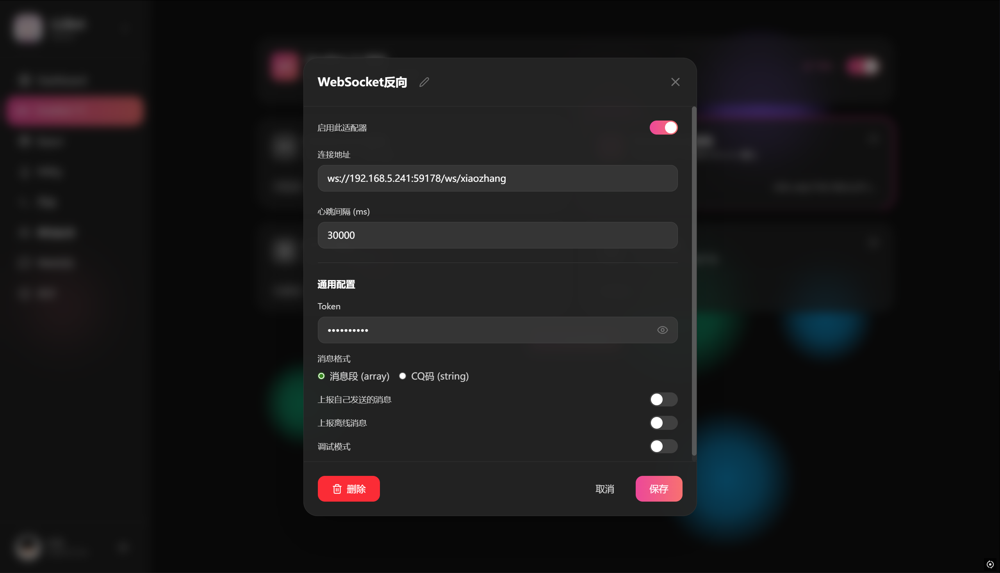

# LLBot 配置文档

## 目录

1. [概述](#概述)
2. [环境要求](#环境要求)
3. [反向 WebSocket 配置](#反向-websocket-配置)
4. [参数说明](#参数说明)
5. [配置示例](#配置示例)
6. [常见问题排查](#常见问题排查)

---

## 概述

LLBot（LuckyLilliaBot）是一个基于 OneBot v11 协议的 QQ 机器人客户端。**本项目仅支持反向 WebSocket 连接模式**，机器人客户端主动连接到 HanChat-QQBotManager 服务端。

---

## 环境要求

| 项目 | 要求 |
|------|------|
| 操作系统 | Windows 10+ / Linux / macOS |
| QQ 客户端 | 官方 QQ 9.x 或更高版本 |
| 网络 | 能访问 HanChat 服务器 |

---

## 反向 WebSocket 配置

### 配置界面



### 配置入口

1. 启动 LLBot 并登录 QQ 账号
2. 在 LLBot 管理界面中找到「网络配置」→「WebSocket 反向」
3. **必须启用「启用此配置」开关**

### 连接地址格式

```
ws://<HanChat_IP>:<端口>/ws/<自定义路径>
```

| 组成部分 | 说明 | 示例 |
|---------|------|------|
| `ws://` | 协议类型，明文传输 | `ws://` 或 `wss://`（TLS） |
| `HanChat_IP` | HanChat 服务器 IP 地址 | `192.168.5.241` |
| `端口` | HanChat WebSocket 监听端口 | `59178`（默认） |
| `自定义路径` | 用于区分不同机器人 | `bot1`、`xiaozhang` |

---

## 参数说明

| 配置项 | 必填 | 默认值 | 说明 |
|--------|------|--------|------|
| 启用此配置 | 是 | `false` | **必须开启**，否则无法建立连接 |
| 连接地址 | 是 | - | HanChat 的 WebSocket 地址 |
| 心跳间隔 (ms) | 否 | `30000` | 心跳包发送间隔，建议保持 30000ms |
| Token | 否 | - | 鉴权令牌，需与 HanChat 的 `WEBSOCKET_AUTHORIZATION` 一致 |
| 消息格式 | 否 | 消息段 (array) | **推荐选择「消息段 (array)」** |
| 上报自己发送的消息 | 否 | `false` | 是否上报机器人自己发送的消息 |
| 上报离线消息 | 否 | `false` | 是否上报离线期间的历史消息 |
| 调试模式 | 否 | `false` | 是否开启调试日志 |

### 关键参数详解

#### 连接地址

完整示例：

```
ws://192.168.5.241:59178/ws/xiaozhang
```

- `192.168.5.241`：HanChat 服务器 IP
- `59178`：HanChat WebSocket 端口（默认）
- `/ws/xiaozhang`：自定义路径，每个机器人应使用不同路径

#### Token

- 用于 HanChat 验证机器人身份
- 必须与 HanChat 的 `WEBSOCKET_AUTHORIZATION` 环境变量**完全一致**
- 建议设置复杂字符串，包含大小写字母、数字和特殊符号

#### 消息格式

- **推荐选择「消息段 (array)」**，结构更清晰，解析效率更高
- 「CQ码 (string)」为兼容格式，不推荐新项目使用

---

## 配置示例

### 基础配置

```
启用此配置：✅ 开启
连接地址：ws://192.168.5.241:59178/ws/bot1
心跳间隔：30000
Token：your-secure-token-here
消息格式：消息段 (array)
上报自己发送的消息：❌ 关闭
上报离线消息：❌ 关闭
调试模式：❌ 关闭
```

### 配置步骤

1. 打开 LLBot 管理界面
2. 进入「网络配置」→「WebSocket 反向」
3. 开启「启用此配置」开关
4. 填写「连接地址」（替换为实际 HanChat IP 和自定义路径）
5. 填写「Token」（与 HanChat 配置一致）
6. 「消息格式」选择「消息段 (array)」
7. 点击「保存」

### 验证连接

保存后观察 LLBot 日志，确认显示 WebSocket 连接成功。在 HanChat 控制台执行 `/bot list` 应能看到该机器人在线。

---

## 常见问题排查

### 连接失败

| 现象 | 排查项 |
|------|--------|
| 连接被拒绝 | 检查 HanChat 是否已启动，IP 和端口是否正确 |
| 连接超时 | 检查防火墙是否放行端口，网络是否连通 |
| 鉴权失败 | 检查 Token 是否与 HanChat 配置完全一致（区分大小写） |

### 频繁掉线

- 适当减小心跳间隔（如改为 20000ms）
- 检查网络稳定性
- 关闭「调试模式」减少日志输出

---

**文档版本**: v1.0  
**最后更新**: 2026-05-03
