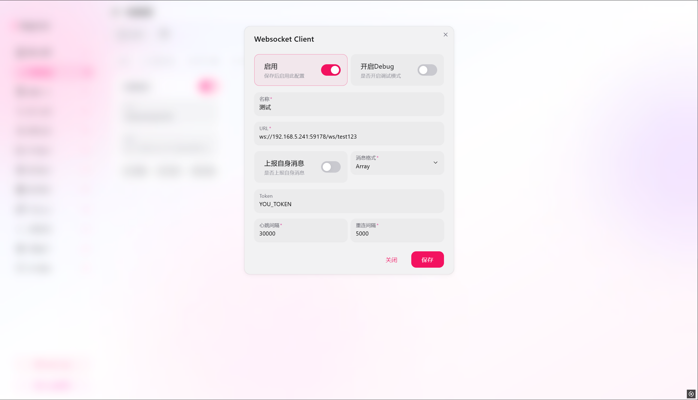

# Napcat 配置文档

## 目录

1. [概述](#概述)
2. [环境要求](#环境要求)
3. [反向 WebSocket 配置](#反向-websocket-配置)
4. [参数说明](#参数说明)
5. [配置示例](#配置示例)
6. [常见问题排查](#常见问题排查)

---

## 概述

Napcat 是一个基于 NTQQ 框架的 OneBot v11 协议实现。**本项目仅支持反向 WebSocket 连接模式**，必须通过「WebSocket Client」配置连接到 HanChat-QQBotManager 服务端。

---

## 环境要求

| 项目 | 要求 |
|------|------|
| 操作系统 | Windows / Linux / macOS |
| 硬件 | 512MB RAM，1核 CPU |
| 网络 | 能访问 HanChat 服务器 |

---

## 反向 WebSocket 配置

### 配置界面



### 配置入口

1. 启动 Napcat 并登录 QQ 账号
2. 浏览器访问 `http://localhost:6099` 打开 Napcat WebUI
3. 在左侧菜单找到「网络配置」→「WebSocket Client」
4. **必须启用「启用」开关**

### URI 格式

```
ws://<HanChat_IP>:<端口>/ws/<自定义路径>
```

| 组成部分 | 说明 | 示例 |
|---------|------|------|
| `ws://` | 协议类型 | `ws://` 或 `wss://`（TLS） |
| `HanChat_IP` | HanChat 服务器 IP | `192.168.5.241` |
| `端口` | HanChat WebSocket 端口 | `59178` |
| `自定义路径` | 区分不同机器人 | `napcat1`、`test123` |

---

## 参数说明

| 配置项 | 必填 | 默认值 | 说明 |
|--------|------|--------|------|
| 启用 | 是 | `false` | **必须开启**，启用此 WebSocket 配置 |
| 开启 Debug | 否 | `false` | 显示调试信息，生产环境建议关闭 |
| 名称 | 否 | - | 配置项名称，用于标识 |
| URI | 是 | - | HanChat WebSocket 地址 |
| 上报自身消息 | 否 | `false` | 是否上报机器人自己发送的消息 |
| 消息格式 | 否 | `Array` | **推荐选择 `Array`** |
| Token | 否 | - | 鉴权令牌，需与 HanChat 的 `WEBSOCKET_AUTHORIZATION` 一致 |
| 心跳间隔 | 否 | `30000` | 心跳包间隔，单位毫秒 |
| 重连间隔 | 否 | `5000` | 断线重连间隔，单位毫秒 |

### 关键参数详解

#### URI

完整示例：

```
ws://192.168.5.241:59178/ws/test123
```

- `192.168.5.241`：HanChat 服务器 IP
- `59178`：HanChat WebSocket 端口
- `/ws/test123`：自定义路径，每个机器人应使用不同路径

#### Token

- 用于 HanChat 验证机器人身份
- 必须与 HanChat 的 `WEBSOCKET_AUTHORIZATION` 环境变量**完全一致**
- 注意区分大小写

#### 消息格式

- **推荐选择 `Array`**，结构清晰，解析效率高
- `String` 为 CQ 码格式，不推荐新项目使用

---

## 配置示例

### 基础配置

```
启用：✅ 开启
开启 Debug：❌ 关闭
名称：测试
URI：ws://192.168.5.241:59178/ws/napcat1
上报自身消息：❌ 关闭
消息格式：Array
Token：your-secure-token-here
心跳间隔：30000
重连间隔：5000
```

### 配置步骤

1. 打开 Napcat WebUI（`http://localhost:6099`）
2. 进入「网络配置」→「WebSocket Client」
3. 开启「启用」开关
4. 填写「URI」（替换为实际 HanChat IP 和自定义路径）
5. 填写「Token」（与 HanChat 配置一致）
6. 「消息格式」选择 `Array`
7. 点击「保存」

### 验证连接

保存后 Napcat 会自动尝试连接。查看 Napcat 日志确认连接成功，在 HanChat 控制台执行 `/bot list` 应能看到该机器人在线。

---

## 常见问题排查

### 连接失败

| 现象 | 排查项 |
|------|--------|
| 连接被拒绝 | 检查 HanChat 是否已启动，URI 中的 IP 和端口是否正确 |
| 连接超时 | 检查防火墙是否放行端口，网络是否连通 |
| 鉴权失败 | 检查 Token 是否与 HanChat 配置完全一致 |

### 频繁断线重连

- 适当减小心跳间隔（如改为 20000ms）
- 检查网络稳定性
- 关闭「开启 Debug」减少日志输出

---

**文档版本**: v1.0  
**最后更新**: 2026-05-03
